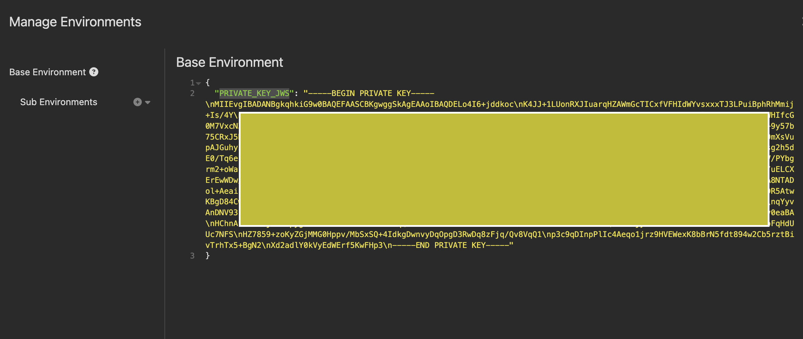

# insomnia-plugin-jws-sign-decode
Sign and decode deserialized jws

## Installation

### From Insomnia Plugin Hub

1. Navigate to [https://insomnia.rest/plugins/insomnia-plugin-jws-sign-decore](https://insomnia.rest/plugins/insomnia-plugin-jws-sign-decode)
2. Click _Install Plugin_
3. Click _Open_
4. Once opened, click _Install_

### From the Insomnia App

1. Go to _Application_ > _Preferences_ **or** click the cog icon (⚙️)
2. Navigate to the _Plugins_ tab
3. Enter `insomnia-plugin-jws-sign-decode`
4. Click _Install_

### Manual Install
1. Using a terminal, `cd` into your Insomnia plugins folder - [See Insomnia Docs](https://docs.insomnia.rest/insomnia/introduction-to-plugins)
2. Run `git clone https://github.com/alvaro-mq/insomnia-plugin-jws-sign-decode.git`

### Usage

- It is necessary to add environment variable ***'PRIVATE_KEY_JWS'*** to sign the json request

- The body should look like:
    

        
    
